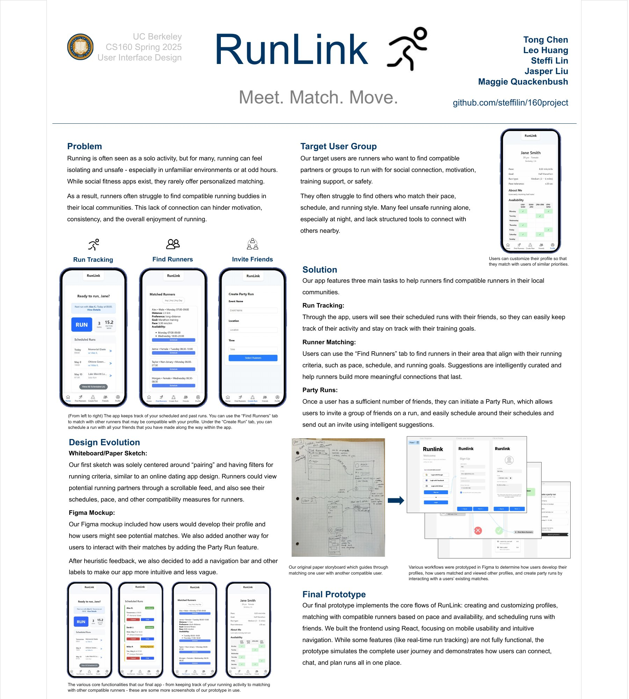

# RunLink

**Meet. Match. Move.**

[](docs/runlink-project-poster.pdf)

> A high-fidelity interactive prototype created as a team project for UC Berkeley CS 160: User Interface Design (Spring 2025).

RunLink explores how runners can find compatible partners in their local communities. Instead of treating running as an exclusively solo activity, the product helps people connect around pace, schedule, location, running goals, and preferred running style.

- [Full project poster](docs/runlink-project-poster.pdf)
- [Original team repository](https://github.com/steffilin/160project)
- Personal website: coming soon

## Problem

Running alone can feel isolating or unsafe, particularly in unfamiliar places or at unusual hours. Existing social fitness products do not always help runners discover nearby people whose pace, availability, and goals are compatible with their own.

RunLink was designed for runners seeking social connection, motivation, training support, or greater confidence when running. The prototype focuses on making partner discovery and group planning understandable within a mobile-first experience.

## Core experience

- **Personalized profiles:** record pace, distance preferences, goals, availability, location, and preferred running style.
- **Runner matching:** browse suggested runners and compare compatibility information before connecting.
- **Run scheduling:** coordinate one-to-one runs or create a Party Run with multiple friends.
- **Friends and chat:** keep track of connections and simulate the communication flow around a planned run.
- **Activity overview:** review scheduled runs, recent activity, run history, and a simulated tracking experience.

## Design process

The project progressed from an initial paper storyboard centered on runner pairing to a broader end-to-end experience:

1. Defined the problem, target users, and compatibility criteria.
2. Sketched the matching flow and early information architecture on paper.
3. Prototyped registration, profile creation, matching, and scheduling workflows in Figma.
4. Incorporated heuristic feedback by clarifying labels, navigation, and task flow.
5. Built the final interactive prototype in React, emphasizing mobile usability and navigation between the core scenarios.

## Prototype status and limitations

This repository represents a course prototype rather than a production service. The `main` branch uses mock user and run data to demonstrate the intended journey. Authentication, persistent storage, real-time location tracking, notifications, and production matching infrastructure are not fully implemented.

The current production build completes successfully with ESLint warnings related to unused prototype code and link accessibility. These warnings are preserved in the archive rather than being mixed into this documentation-only cleanup.

## Technology

- React 19 and Create React App
- React Router
- JavaScript, HTML, and CSS
- Lucide and React Icons
- Figma for interaction and workflow prototyping

## Team

- Tong Chen
- Leo Huang
- Steffi Lin
- Jasper Liu (GitHub: [@JJJasperl](https://github.com/JJJasperl))
- Maggie Quackenbush

This was a collaborative team project. The original Git history and author metadata are preserved, including the historical `backend`, `findRunnerPage`, and `friends` branches. The archive does not assign exclusive ownership of individual features where the team did not record a formal division of work.

## Run locally

```bash
cd frontend
npm ci
npm start
```

Open [http://localhost:3000](http://localhost:3000) in a browser.

To create a production build:

```bash
npm run build
```

## Repository structure

```text
.
├── docs/
│   ├── runlink-project-poster.jpg  # README preview
│   └── runlink-project-poster.pdf  # Full project poster
├── frontend/
│   ├── public/
│   └── src/
│       ├── components/
│       ├── data/
│       ├── pages/
│       └── styles/
└── README.md
```

## Archive note

This public repository is a personal archival mirror of the original team repository. It preserves the collaborative commit history and course materials for portfolio documentation. Any future portfolio page should continue to credit the full team and describe RunLink as a prototype.
